# Journal

A journal of my progress on this project.

## Feb 16

### Init (ffcfaed)
* Initialized project
* Created README.md

### Vectors (ca9c4a4)
Created the `Vec3` and `Point3` structs.

Each of these represent a point in 3-dimensional space. Internally, a Vec3 is represented the same way as a Point3.
The distinction is that a Vec3 has different semantics as to how it can be used.

A vector can be imagined as an arrow pointing to a point.
A *normalized* vector is any vector with a length of 1, meaning that it lands on some point on the unit circle (shown as purple in the diagram below). The orange and green arrows are normalized vectors.

Red arrows are arbitrary vectors. These can be normalized by extending or retracting their length until it's equal to 1.

A vector can be trivially converted to a point, and vice versa. See how the point `(1.75, 1)` can be represented both by a vector pointing to it, and solely by a point.


Vectors can be added and subtracted; subtracting a vector is equivalent to adding the negative of that vector.


`Vec3`s store whether or not they are normalized through something called the [typestate pattern](https://cliffle.com/blog/rust-typestate); this makes it a compile-time error to pass an unnormalized vector to a function requiring a normalized vector.

Quoting from the documentation of `Vec3`, this snippet will fail to compile, because `Vec3::new` returns a `Vec3<Unknown>`.
```rs
fn use_normalized(vec: &Vec3<Normalized>) {
    // ...
}
use_normalized(&Vec3::new(1.0, 2.0, 3.0)); // shouldn't compile!
```

This will work, because `as_unit()` returns a vector that is known to be normalized!

```rs
use_normalized(&Vec3::new(1.0, 2.0, 3.0).as_unit());
```

### Color & Interval (5b245d5)
Added the Color and the Interval structs - neither are particularly interesting and mostly copied from previous projects.

## Feb 17

### PPM Format
[assets/test-ppm.ppm](assets/test-ppm.ppm)

PPM is a very simple image format. It starts with a header:
```
P3
<width> <height>
<max-brightness>
```
And from then on, each row is three space-delimited integers, representing the brightness of each RGB value.
The start of `test-ppm` appears as so:

```ppm
P3
256 256
255
0 0 0
1 0 0
2 0 0
3 0 0
4 0 0
5 0 0
6 0 0
7 0 0
8 0 0
9 0 0
10 0 0
11 0 0
12 0 0
...
```

### Using the `Color` struct

Since changing over to the `Color` struct for writing colors, things look fairly different because of gamma-correction.
I'll probably write more on gamma-correction later because it's interesting, but suffice it to say that effectively, 
all color values are square rooted.

### `Ray` struct

`Ray` is a small utility class I forgot to implement yesterday.
It represents a vector that starts at a single point, and allows calculating a point along that vector.
It can also be thought of as a function $P(t) = A + tB$, 
where $A$ is the `point` it originates from and $B$ is a vector travelling from that point.
Accordingly, a $t$ value of `0.0` will return point $A$, a value of `1.0` will return the vector sum of $A$ and $B$,
and values outside that range will be extended **past** the area that vector $B$ covers.

### Sending Rays

Fundamentally, a ray tracer does a few simple steps. 
1. Create a ray from the camera through a given pixel.

2. Find what objects in the scene the ray touches.
3. Find the color of the closest touched object.

Since we cast rays through a 2d plane (marked as `Viewport` above), representing 2d coordinates would be a good idea.
2d coordinates can be represented with a Vec3 or Point3 by setting `z` to `0.0`, but having separate structs for a 2d space
is a better practice because 2d coordinates must be limited to a 2d space. 
Setting a different `z` value should not be an option.

### Viewport


The viewport has a few properties that need to be considered. First, we need to be able to navigate through it.
We can define 2D vectors $u$ and $v$ as vectors that cross the top and side of the viewport, and then
divide them by the viewport's width and height respectively to get $\Delta u$ and $\Delta v$, 
which define the distance between rendered pixels.

The rays we send towards pixels should be sent to the **center** of those pixels, 
so we need to shift their positions by $\frac{1}{2}\Delta v + \frac{1}2\Delta u$ 
to make them centered. This is represented by the red vector in the above image.

### Background

If rays don't hit anything, what do we render? The guide suggests rendering
a bluish colour based on the y-value of the ray. The ray has to be normalized first,
so that the y component cannot be larger than `1.0`.

> **Sidenote**: In hindsight, enabling gamma correction earlier was a mistake as many of the
> examples used in the guidebook assume it's disabled. Since reenabling it is a
> simple matter of adding `.as_gamma_corrected()`, I'll disable it again for now.

### Sphere intersection

Mathematical details about ray-sphere intersection are available in 
[Ray Tracing in One Weekend](https://raytracing.github.io/books/RayTracingInOneWeekend.html#addingasphere/ray-sphereintersection), so I won't go into too much detail.
Essentially, we derive a formula that has one solvable root each time it passes through an edge of the sphere;
from this, we can determine whether or not the ray has hit the sphere.
For now, if it has, we'll render it in a color describing the normal vector off of its surface.

### `Hittable` trait

The `Hittable` trait describes an object or a body that can be hit. 
Currently, only `Sphere`s can be hit, but other objects will be added later.

## Feb 20

I've been sick for the last few days, so not much progress has been made.
However, I did fix a bug where the colours indicating the normal vectors off the sphere were
calculated incorrectly.

Functions were refactored to use the Interval struct.

Camera code was refactored into its own struct. Since it's fairly complicated,
the builder pattern may need to be used later once it grows more complex.
For now, having some simple initialization functions suffices.

### Antialiasing

The images we're creating are only 400px wide, so of course there will be some jaggedness.
However, when the pixels are coloured according to whether or not the center of them
intersects an object, there's a very sudden change in colour at the edge of the object.

Antialiasing is our solution to this problem. Instead of always calculating a single pixel, 
a given pixel is sampled multiple times at slightly varying positions, then averaged together.

> **\***_[Pixels aren't always squares](https://www.researchgate.net/publication/244986797_A_Pixel_Is_Not_A_Little_Square_A_Pixel_Is_Not_A_Little_Square_A_Pixel_Is_Not_A_Little_Square),
> but it's an assumption that ususally holds well enough._

We'll sample from a square centred at the centre of the pixel, but I'm curious to know if/how sampling
from a disc instead affects the resultant rendering.

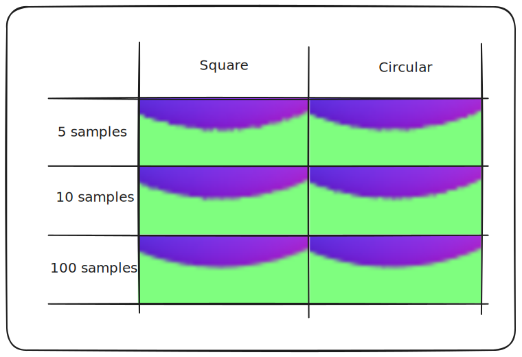

After some experimentation... there isn't really a discernable difference, as far as I can tell.
I'll just stick to square for now for its simplicity.

Also, effects are definitely noticable at 100 samples compared to 10, but the 10x speed increase is
much more valuble to me on a MacBook. For development, I'll probably keep a very low sampling value
or disable antialiasing entirely.

### Ray Bouncing

Finally, the rays actually start being traced! Each time a ray bounces (in a random direction in a hemisphere
off the normal), the brightness it impacts the pixel is reduced by 1/2. So we don't end up with recursions
causing a stack overflow, rays end as black at 10 bounces.

This makes the balls a nice grey-blue colour; the blue is reflected from the sky!

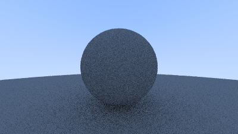

### Lambertian Distribution

Unfortunately, physics doesn't behave in a simple way. There's a probablility to
where a ray will be reflected off a diffuse (matte) surface, and it's roughly described 
by the [Lambertian Distribution](https://en.wikipedia.org/wiki/Lambertian_reflectance):

$B_D=\mathbf{L} \cdot \mathbf {N} CI_{\text{L}}$

This is the dot product of the surface's normal vector 
$\mathbf{N}$ and a light vector $\mathbf{L}$, multiplied by the color 
and intensity of the light hitting the surface.

In other words, the distribution follows Lambert's Cosine Law: that radiant 
intensity is the same from all angles of observance. The intensity of a reflected
beam is based on its angle compared to the normal of the surface.

Math-heavy side note over, this doesn't make much of a difference for the simple scene here.
It really helps to emphasize shadows, though, and is a much more accurate simulation.

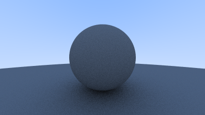

> *I increased the `samples_per_px` value for the Lambertian 
> distrbution demo so we can see a nice image.*
> 
> *On my machine, this took nearly a minute to render.*

### Gamma Correction

Time to turn gamma correction back on! Now that we can demonstrate with reflectance,
it's a lot clearer why it's required. These images are both rendered with bands where
the objects have a reflectance of `10%`, `30%`, `50%`, `70%`, and `90%`.

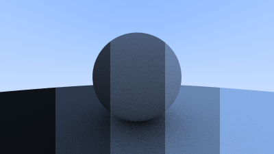

Using a colour picker, the colour of the ground in the `10%` slice has a value of `#0e1218`.
The slice at `50%` is `#344155`, and the 90% slice is `#83a9e1`.

HSL (hue, saturation, and lightness) is a color field useful for evaulating how light a colour is.
It can be easily converted to from RGB as $\frac{(C_{max} + C_{min})}{2}$, where $C_{max}$ is the most significant
colour value of red, green, and blue, and $C_{min}$ is the least significant value.

Using these lightness values, we can take a look at this table:

| Reflectance   | Color (RGB) | Original Lightness (HSL) |
|--------------:|-------------|--------------------------|
| 10%           | `#0e1218`   | 7%                       |
| 30%           | `#202a38`   | 17%                      |
| 50%           | `#344155`   | 27%                      |
| 70%           | `#5b7398`   | 48%                      |
| 90%           | `#83a9e1`   | 70%                      |

Huh. That doesn't seem very linear - halfway between 10% and 90% should be 50% lightness, not 70%!

Gamma encoding is used to make sure that we don't waste bits distingushing between colours that humans can't see.
In order to convert from linear to gamma-2 encoding, we just need to square root each colour value.

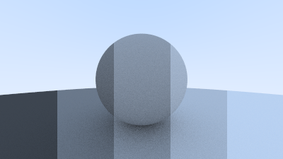

This leaves us with this improved table:

| Reflectance   | Original Lightness (HSL) | Gamma-Corrected Lightness (HSL) |
|--------------:|--------------------------|---------------------------------|
| 10%           | 7%                       | 26%                             |
| 30%           | 17%                      | 41%                             |
| 50%           | 27%                      | 47%                             |
| 70%           | 48%                      | 67%                             |
| 90%           | 70%                      | 83%                             |

Much more even!

## Feb 21

### Materials

So far, the material an object is made of has been hardcoded in the `Camera::ray_color()` function.
To assign different objects different materials, we need to create a `Material` trait and a `Lambertian`
struct that impls it. While we're at it, let's create a second material: reflective metal.

With simple specular reflection from a polished metal, the angle of incidence $\theta_i$ is equal
to the angle of reflection, $\theta_r$, when both are measured from the normal of the surface.
This reflected ray is equal to $V - 2N (V \cdot N)$.

## Feb 25

### Debugging

After creating that metal, I set up a test scene:

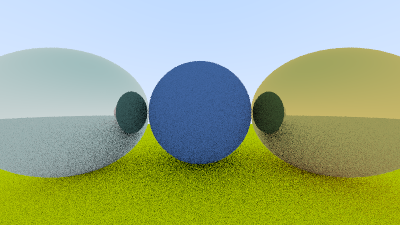

Something seems off, though. The right-hand sphere looks okay, but what's going on with the left sphere?
That doesn't look like it's properly reflecting - it's super tinted!

The issue turned out to be a single line of code: 

```diff
- b: self.b * rhs.g,
+ b: self.b * rhs.b,
```

Can you see the error? The blue channel was being influenced by the green channel when two colours were
combined. The correct image looks like this: 

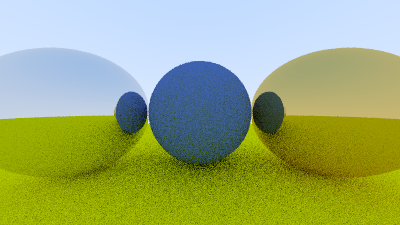

### Fuzziness

We can simulate perfectly smooth metal, but what about metal that doesn't reflect perfectly?
Surfaces with imperfections - in other words, fuzziness?

After reflecting using a perfect metal simulation, we can add a little nudge to where the ray
actually ends up. This is an easy way to simulate fuzziness.

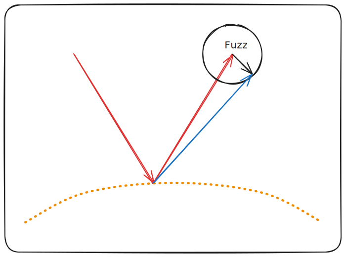

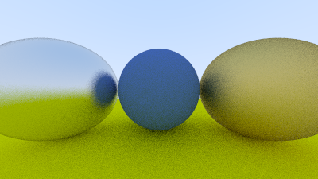

### Dielectric Materials

**What are dielectric materials?**
<details>
"Dielectric" mediums are materials that respond to a polarizing electric field. 
Since light is an electric field, the medium oscillates at an atomic level when the light passes through.
These oscillations produce their own electric fields, which interfere via Maxwell's equations to
form a wave with the same frequency and a different (usually shorter) wavelength. 

> [More](https://www.reddit.com/r/askscience/comments/3izy8j/comment/cum0ktg)
> [details](https://en.wikipedia.org/wiki/Maxwell%27s_equations#Vacuum_equations,_electromagnetic_waves_and_speed_of_light)
</details>

When a light ray hits a dielectric, it may split into two rays: a **reflected** ray and a **refracted** ray.
A **reflected** ray is a ray that bounces off the surface, just like the rays that have been simulated so far.
A **refracted** ray is a ray that continues through the surface. However, due to the change in speed a dielectric
medium imposes, refracted rays typically change their angle as they pass through the object's surface -
like how a rod appears to bend when inserted into water, or how a glass lens flips an image upside-down.

> **Note**: because we send several rays through each pixel, it's not necessary to simulate splitting the ray.
> Instead, we select with a given probablility whether that ray becomes reflected or refracted.
> This ensures that we always have a constant number of rays travelling through the scene.

Refraction is described by [Snell's Law](https://en.wikipedia.org/wiki/Snell%27s_law),
$\eta \cdot sin \theta = \eta^\prime \cdot sin \theta^\prime$, 
where $\theta$ and $\theta^\prime$ are the angles from the normal, 
and $\eta$ and $\eta^\prime$ are the refractive indices/coefficients.

Ray Tracing in One Weekend goes into [more detail](https://raytracing.github.io/books/RayTracingInOneWeekend.html#dielectrics/snell'slaw),
but eventually this equation can be used to determine the refracted ray $R^\prime$ from an incoming
ray $R$ and the ratio of refractive indices, $\frac{\eta}{\eta^\prime}$.

At certain angles, dielectrics are forced to reflect instead of refracting because Snell's law
no longer has a solution.

This image has a glass ball which contains a bubble of air.

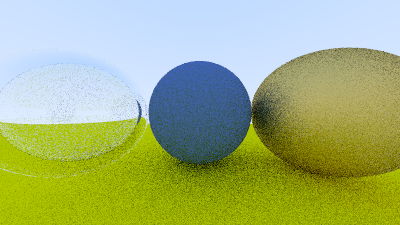

### Camera definitions

Some good features for a camera would be:
- An adjustable FOV (field of view): the angle at which the camera sends out rays
- An adjustable origin position (although `(0, 0, 0)` is probably a good default)
- A depth of field / focal distance: real cameras are only focused at a certain distance.
We can simulate that by firing rays from across a disc, instead of from a singular point.
The focal plane is in the same plane as the viewport, and the rays fired from the disc converge
on that viewport. 

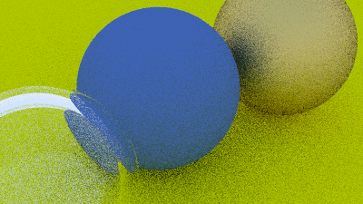

## Feb 27

After finishing implementing everything noted above, we're done with Ray Tracing in One Weekend!
This is a fully functional ray tracer - albeit a bit of a slow and limited one.

Let's render a relatively complicated test scene, with a lot of randomly generated spheres.

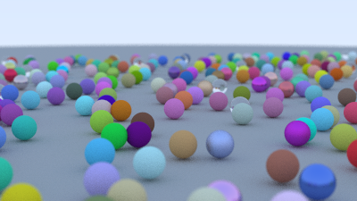

Does it look cool? **Yes!**

Does it seem to work? **Yes!**

Did it take twenty minutes to render? **ye-wait, what?**

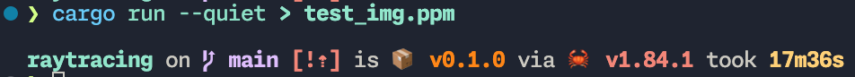

*oops*. Well, that's a problem for another day.

## Feb 28

### Quality of Life Features

Before moving on to _Ray Tracing: The Next Week_, there are some utility features I want to implement.
First, it would be nice to have some estimation of when the program is going to complete, when it's running
for twenty minutes. A progress bar would be a useful feature to have.

Rust has a great library for this: [Indicatif](https://docs.rs/indicatif/latest/indicatif/).

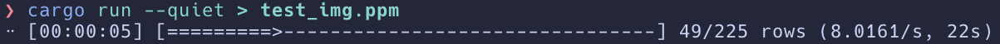

This looks great, and it's easy to implement. I only needed five lines of code.
When we eventually use [rayon](https://docs.rs/rayon/latest/rayon/) for multithreading,
`indicatif` has a feature that supports multithreaded iterators.

The second feature I want to add is being able to export to a format other than `ppm`.
The problem with `ppm` is that it isn't supported natively by most image viewers,
including those that typically render Markdown files. In order to view it in VSCode, 
I even had to install a designated extension. 

The PNG (Portable Network Graphics) format is ubiquitous on the Internet. Since the specifics of
PNG encoding isn't the focus of this project, I'll use the [image](https://docs.rs/image/latest/image/)
crate to encode my images.

> I used the [ImageMagick](https://imagemagick.org/index.php) tool to convert my existing PPM
> files in the assets folder.

## Mar 6

Today, I'm going to start moving on to the next book in the series, _Ray Tracing: The Next Week_.
Starting with a relatively easy concept, I'll simulate motion.

### Motion Blur

Since motion occurs over time, I'll need a 4-dimensional Ray struct to simulate it.
The 4th dimension involved is time; a 4D ray can store what time it's being sent at.

This allows the calculation of not only the intersection in space, but also in time.
A rary projected at a given time may not intersect an object.

The current implementation of motion blur assumes that all objects move linearly 
across the frame, which isn't entirely accurate to a scene like depicted with balls
"bouncing" up and downwards. A more complicated implementation of movement over a
frame would be a good idea for extension.
<!-- TODO: improve movement over frame -->

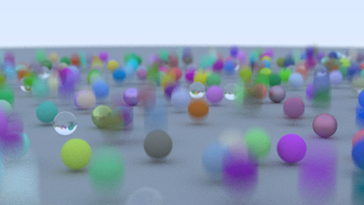

### Optimizations (Bounding Volume Hierarchies)

After getting a nice warm-up done, I'll move on to a more challenging
and significant part of the ray-tracer: BVHs.

Bounding Volume Hierarchies are a technique used to improve the speed
of the code. In the current version, when a ray bounces off an object it has to
check every other Hittable in the scene to see if it intersects.

If the scene could be divided into a hierarchy of smaller regions, the ray could
choose to only check the nearest region in the desired direction.

For instance, if you have some spheres inside a cube, the cube can be
checked for an intersection. If the cube is not hit, there's a
guarantee that none of the contained spheres are also hit.

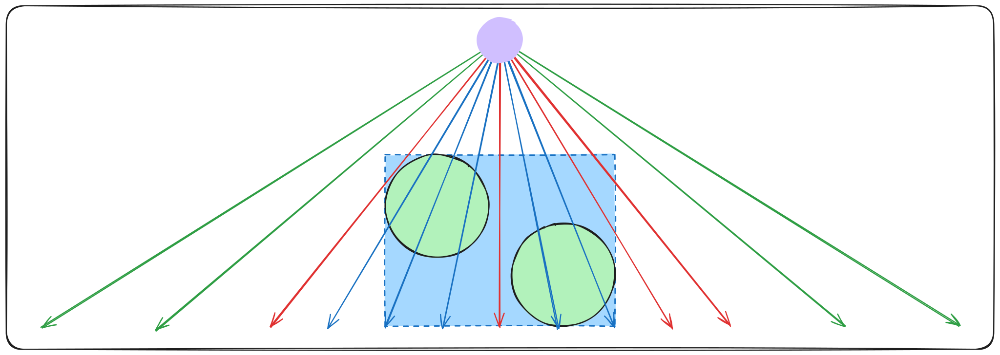

### Defining Bounding Boxes

Notably, in order for the BVH startegy to work, there needs to be a fast way to
- a. create useful volumes 
- and b. quickly check whether a ray intersects with a hierarchy of volumes.

In practice, for most (but not all) models, axis-aligned rectangular prisms
tend to solve both of these problems the best. For short, I'll call them
AABBs; axis-aligned bounding boxes.

Unlike collisions with an object, points, normals, and other data don't need to
be found when testing AABB intersections. This is because they're not rendered;
it doesn't matter where they are on the screen, only whether or not a ray intersects them.
This means they can't implement `Hittable`; it requires either a `None` value (the ray missed)
or `Some(details)` (the ray did hit, and all the details of the hit are provided).
Later, I'll need to create another struct that _does_ implement `Hittable` to proxy
the events.

The simplest way to create AABBs is to constrruct them based on the idea that a
$n$-dimensional rectangle (i.e. a rectangle or rectangular prism) is composed of $n$ 
intervals (for instance, `(2.0, 3.0)`) - one for each axis. Given this, a bounding box
is just the overlap of the intervals, which forms a rectangle in 2d space
and a rectangular prism in 3D space.

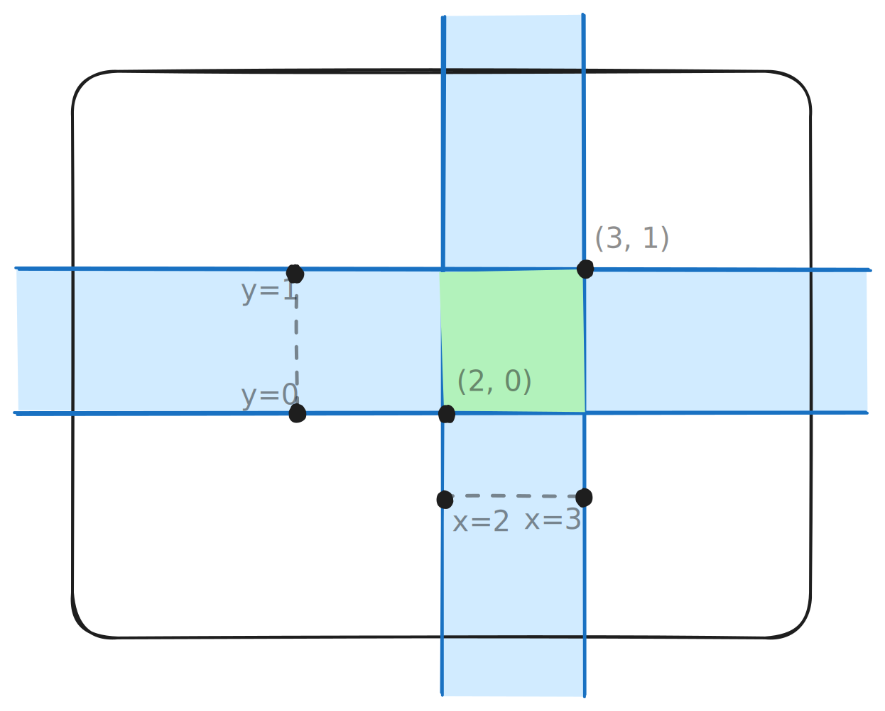

### Collisions

Remembering that the formula for a ray is $P(t) = A + tB$, an interval of $t$ values where
the ray intersects a given plane can be found. If a $t$ interval is computed for each axis of 
the box, and all of these $t$ intervals overlap, the ray must be intersecting the bounding box.

In the image below, areas $A_x$ and $A_y$ don't overlap; neither do areas $C_x$ and $C_y$.
But since ray $B$ goes through the bounding box, areas $B_x$ and $B_y$ intersect inside
that box.

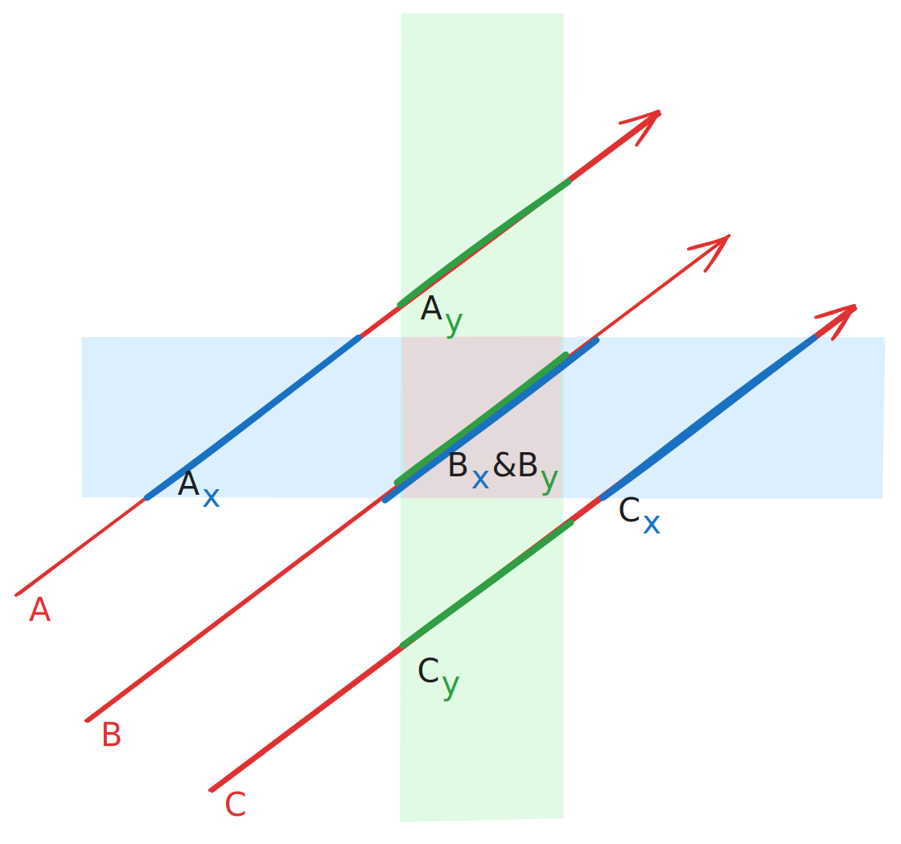

This is really quick to check - just compute the $t$-value of the ray at each edge of a given
axis's interval with $t_{0x} = \frac{x_0 - A}{B}$, where $A$ is the origin point of the ray, 
$B$ is  the ray's vector, $x_0$ is the lowest value of the x-axis interval, and $t_{0x}$ is the 
$t$-value where the ray intersects $x_0$. Swapping out $t_{1x}$, the farther part of the x-axis
interval, the second half of the $t$ interval is $t_{1x} = \frac{x_1 - A}{B}$, and
the final x-axis interval of $t$ values is ($t_{0x}$, $t_{1x}$).

This is really quick to compute - just some addition, multiplication, and intersection logic
(which is mostly `<=` and `>=` statements).

## Mar 9

### Hittable Bounding Boxes

All `Hittable` objects should be able to provide a bounding box that encompasses them,
so the `Hittable` trait has been extended with a new method:

```rs
    fn bounding_box(&self) -> Option<&BoundingBox3>;
```

This indicates that anything that is `Hittable` must be able to return either its own
bounding box (`Some<&BoundingBox3>`), or indicate that it doesn't have a bounding box and 
therefore doesn't need to be hit (`None`). An example of this behaviour would be an empty 
`HittableVec`; a `HittableVec` proxies hits to its contained objects, but if it doesn't have
any objects there's no need to accept hit attempts.

A `Sphere` just returns the bounding box of a cube circumscribed around itself, which
is trivial to calculate with the radius and center of the sphere. A `HittableVec`,
if it holds objects, should return the smallest rectangle that can fit over all its'
children's own bounding boxes.

### Hierarchies

The key to this optimization lies in the name: Bounding Volume *Hierarchies*.

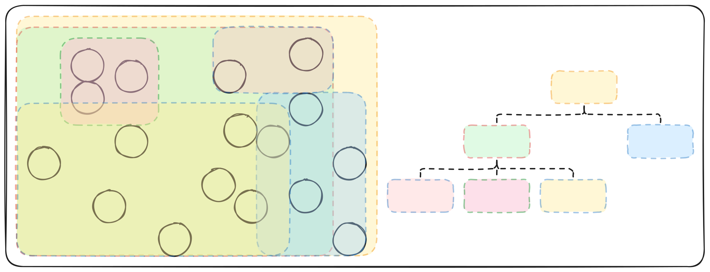

The algorithm starts at the top of the tree, checks the parent bounding box, and then starts 
stepping down the tree, checking each child as it goes.
If the ray doesn't touch a parent element of the tree, the ray tracer can be sure that 
the rest of that branch can be entirely skipped, because every parent encompasses all of its 
children. Instead of checking (with a slow algorithm, because checking renderable objects 
produces hit metadata) all 100 objects in the scene, it quickly (without metadata) checks 20 
parent objects before deciding there are only 10 objects that need to be hit and rendered.

This results in at least a 2x speedup.

### Textures

It would be really nice to be able to draw a texture, like an external image,
onto one of the objects. In theory (with difficulty) I could add a `Material` that
changes its colour based on some parameter, like the y-value of the hit.
That would look something like this: 

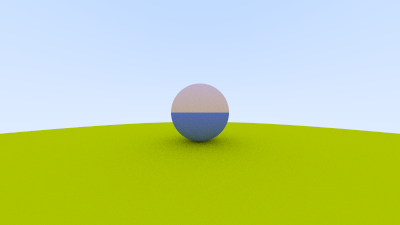

To implement this, I just copied the code for Lambertian materials, but added this line:
```rs
attenuation = match hit_point.y > self.y_parameter {
    true => self.color1,
    false => self.color2,
};
```

It does work, but it's hard-coded and making any changes would be difficult.
Plus, it still doesn't let me upload an arbitrary texture; I'd have to hard-code
all the features of whatever I wanted to add.

Firstly, some definitions. Texture Mapping is the process of mathematically applying (mapping)
a property (the texture) onto an object in the scene. The most common property used is color,
but it could also be the shininess, shape (adding valleys or mountains), or transparency.

For color mapping, a function needs to be defined that takes in points on the surface of an object,
and returns the color that should be rendered at that point. The easiest way to provide a texture is 
with a 2D image, and the $x$ and $y$ coordinates on that image are, by convention, called $u$ and $v$.

This means we can create a `Texture` trait like so:

```rs
trait Texture {
    fn value(&self, u: f64, v: f64, point: &Point3) -> Color;
}
```

A solid color would implement the trait very simply, ignoring the arguments
and only returning its own Color:

```rs
impl Texture for SolidColor {
    fn value(&self, _u: f64, _v: f64, _point: &Point3) -> Color {
        self.albedo
    }
}
```

### Spatial Textures

A "spatial" texture ignores the $u$ and $v$ coordinates, and is solely based off of its point in 3d space.
A simple example of this texture is a checkerboard-style pattern, which takes two textures and a scaling value
and, depending on the point in 3D space, returns either of those input textures.

Adjusting the Lambertian material to accept textures, instead of only colors, the ground can be rendered
as a checkerboard.

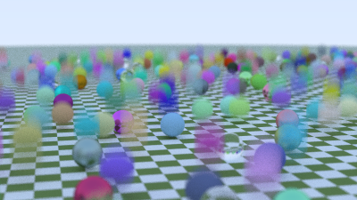

### 