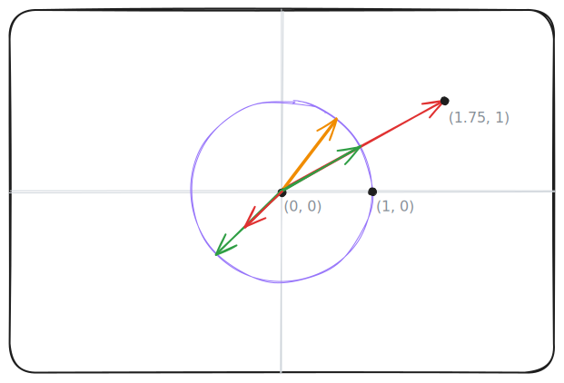

# Journal

A journal of my progress on this project.

## Feb 16

### Init (ffcfaed)
* Initialized project
* Created README.md

### Vectors (ca9c4a4)
Created the `Vec3` and `Point3` structs.

Each of these represent a point in 3-dimensional space. Internally, a Vec3 is represented the same way as a Point3.
The distinction is that a Vec3 has different semantics as to how it can be used.

A vector can be imagined as an arrow pointing to a point.
A *normalized* vector is any vector with a length of 1, meaning that it lands on some point on the unit circle (shown as purple in the diagram below). The orange and green arrows are normalized vectors.

Red arrows are arbitrary vectors. These can be normalized by extending or retracting their length until it's equal to 1.

A vector can be trivially converted to a point, and vice versa. See how the point `(1.75, 1)` can be represented both by a vector pointing to it, and solely by a point.



Vectors can be added and subtracted; subtracting a vector is equivalent to adding the negative of that vector.


`Vec3`s store whether or not they are normalized through something called the [typestate pattern](https://cliffle.com/blog/rust-typestate); this makes it a compile-time error to pass an unnormalized vector to a function requiring a normalized vector.

Quoting from the documentation of `Vec3`, this snippet will fail to compile, because `Vec3::new` returns a `Vec3<Unknown>`.
```rs
fn use_normalized(vec: &Vec3<Normalized>) {
    // ...
}
use_normalized(&Vec3::new(1.0, 2.0, 3.0)); // shouldn't compile!
```

This will work, because `as_unit()` returns a vector that is known to be normalized!

```rs
use_normalized(&Vec3::new(1.0, 2.0, 3.0).as_unit());
```

### Color & Interval (5b245d5)
Added the Color and the Interval structs - neither are particularly interesting and mostly copied from previous projects.

## Feb 17

### PPM Format
[assets/test-ppm.ppm](assets/test-ppm.ppm)

PPM is a very simple image format. It starts with a header:
```
P3
<width> <height>
<max-brightness>
```
And from then on, each row is three space-delimited integers, representing the brightness of each RGB value.
The start of `test-ppm` appears as so:

```ppm
P3
256 256
255
0 0 0
1 0 0
2 0 0
3 0 0
4 0 0
5 0 0
6 0 0
7 0 0
8 0 0
9 0 0
10 0 0
11 0 0
12 0 0
...
```

### Using the `Color` struct

Since changing over to the `Color` struct for writing colors, things look fairly different because of gamma-correction.
I'll probably write more on gamma-correction later because it's interesting, but suffice it to say that effectively, 
all color values are square rooted.

### `Ray` struct

`Ray` is a small utility class I forgot to implement yesterday.
It represents a vector that starts at a single point, and allows calculating a point along that vector.
It can also be thought of as a function $P(t) = A + tB$, 
where $A$ is the `point` it originates from and $B$ is a vector travelling from that point.
Accordingly, a $t$ value of `0.0` will return point $A$, a value of `1.0` will return the vector sum of $A$ and $B$,
and values outside that range will be extended **past** the area that vector $B$ covers.